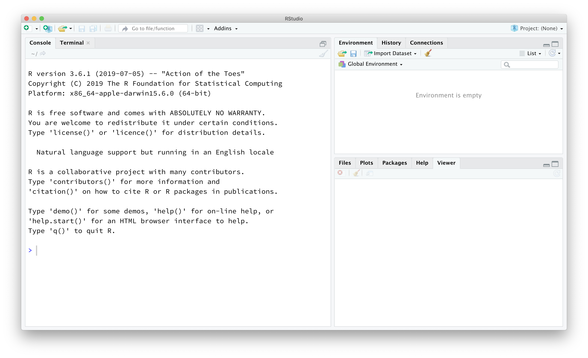

```{r global_options, include=FALSE}
knitr::opts_chunk$set(eval = TRUE, results = FALSE)
library(tidyverse)
library(openintro)
```

## Getting Started

#### Goal

The goal of this lab is to introduce you to R and RStudio, which you'll be using throughout the course both to learn the statistical concepts discussed in the course and to analyze real data. To clarify which is which: R is the name of the programming language itself and RStudio is a convenient interface. Vassar hosts an RStudio server that you can use while on campus; you all should already have accounts on the server.

#### Making the Most of Labs

As you work through a lab, be sure to thoughtfully read all of the text and don't simply jump to running the code and answering questions. Also, avoid blindly copying & pasting code; instead, type the code, thinking about what *command* you're using and the *inputs* you're specifying. As the labs progress, you are encouraged to explore beyond what the labs dictate; a willingness to experiment will make you a much better programmer. But first, before we get to that stage, you need to build some basic fluency in R.

#### Accessing RStudio

To access RStudio, you can either download the software to your computer or you can access it via Posit Cloud. 

- [Instructions](../resources/r.qmd)

Today we begin with the fundamental building blocks of R and RStudio: the interface, reading in data, and basic commands.

## The RStudio Interface

Go ahead and launch RStudio. You should see a window that looks like the image shown below.

```{r r-interface-2020, echo=FALSE, results="asis"}

```

The window on the left is where the action happens. It's called the *console*. Everytime you launch RStudio, it will have the same text at the top of the console telling you the version of R that you're running. Below that information is the *prompt*. As its name suggests, this prompt is really a request: a request for a command. Initially, interacting with R is all about typing commands and interpreting the output. These commands and their syntax have evolved over decades (literally) and now provide what many users feel is a fairly natural way to access data and organize, describe, and invoke statistical computations.

The window in the upper right contains your *environment* (a list of all objects you've created), as well as a history of the commands that you've previously entered.

Any plots that you generate will show up in the window in the lower right corner. This is also where you can browse your files, access help, manage packages, etc.

### R Packages

R is an open-source programming language, meaning that users can contribute packages that make our lives easier, and we can use them for free. For this lab, and many others in the future, we will use the following R packages:

<!--- - The suite of **tidyverse** packages: for data wrangling and data visualization--->

-   **dplyr**: for data wrangling
-   **ggplot2**: for data visualization
-   **openintro**: for data and custom functions with the OpenIntro resources

The **dplyr** and **ggplot2** packages are part of the **tidyverse** suite of packages, all of which share common philosophies and are designed to work together. You can find more about the packages in the tidyverse at [tidyverse.org](http://tidyverse.org/). The **openintro** package is a companion to our textbook and contains datasets that we'll use for labs and homework.

If you're using the RStudio server, then the packages should already be installed for you and you can simply *read* the next section as FYI.

If you're using RStudio on your desktop, then you *may* already have installed the packages previously. To check which packages (and which versions) are already installed, look in the *Packages* tab in the lower right panel of RStudio. If a package appears in that list, then it's installed. If you haven't yet installed these 3 packages, then read below for instructions on installing a package.

#### Installing R Packages

**Note:** Again, if you are using the RStudio server, then you do not need to follow the steps in this section. But it's a good idea to still read it as FYI in case you ever need to install a package.

<!---If these packages are not already available in your R environment, install them by typing the following lines of code into the console of your RStudio session, pressing the enter/return key after each one. --->

Type the following commands into the console of your RStudio session:

```{r install-packages, message=FALSE, eval=FALSE}
install.packages("dplyr")
install.packagse("ggplot2")
install.packages("openintro")
```

You may need to select a server from which to download; any of them will work.

#### Loading R Packages

After you've installed a package, you need to load them into your working environment. We do this with the `library` function. Run the following lines in your console.

```{r load-packages, message=FALSE}
library(dplyr)
library(ggplot2)
library(openintro)
```

#### Installing vs. Loading R Packages

Installing and loading packages can be confusing; what's the difference? You only need to *install* packages once, but you need to *load* them each time you relaunch RStudio. A helpful analogy is with books - you must *purchase* a book once (from the bookstore), but you need to *remove it from the bookshelf* each time you want to read it.

### Preparing your reproducible lab report

We will be using a markdown language to prepare lab report.

We will be using Quarto Markdown to create lab reports. This allows you to complete your lab entirely in RStudio and also ensures reproducibility of your work. See the following video further describing how to use Quarto. Note the first half of the video is more relevant for this class than the second half.

[**Getting Started with Quarto**](https://www.youtube.com/watch?v=_f3latmOhew)

You are not expected to create your lab report from scratch. Instead, we have a template for you that you can edit into your own work. First, download the `lab1.qmd` file to your computer. Then in the Files tab in lower right box, click Upload -\> Choose File and click on the downloaded `lab1.qmd` file. To open this template, go to the Files tab in the bottom right box. Before proceeding, be sure to save your report. In the top left corner, go to Files -\> Save As. The file extension should be `.qmd`.

#### Rendering your report

Before you continue, type your name at the top of the lab template. Then click on Render and you will see your document pop up as an HTML in a new window. One tip is to render often; that way you will hopefully detect errors sooner and be able to fix them more easily. Don't worry too much now about making your report look perfect; instead focus on exploring the data to make a story and creating a reproducible lab report.

#### Submitting your report

When you're finished with the lab and are ready to submit it, replace `html` in the top box with `pdf`. Render the pdf file. In the Files box in the bottom right box, check the box next to `lab1.pdf`. Then go to More -\> Export... -\> Download. This will download `lab1.pdf` to your computer. Now you can go to Gradescope and submit this file for your first lab report. Congrats!!!

#### Where to type commands?

A common question is whether to type the commands in the Quarto file or directly in the console. A general rule of thumb is to type any command you want to keep a record of in the Quarto file and that would be necessary for subsequent commands in your file to work (e.g. a command to calculate the mean number of births from a dataset requires that you've previously read the data into R), and any command you're simply "testing out" in the console window. Keep in mind that your Quarto file should be *reproducible* - that is, you should be able to render it without errors.

```{=html}
<!---Going forward you should refrain from typing your code directly in the console, and instead type any code (final correct answer, or anything you're just trying out) in the Quarto file and run the chunk using either the Run button on the chunk  (green sideways triangle) or by highlighting the code and clicking Run on the top  right corner of the Quarto editor. 
If at any point you need to start over, you can Run All Chunks above the chunk you're working in by clicking on the down arrow in the code chunk. --->
```
## Dr. Arbuthnot's Baptism Records

The data we will explore today is the Arbuthnot dataset. The name refers to Dr. John Arbuthnot, an 18<sup>th</sup> century physician, writer, and mathematician. He was interested in the ratio of babies assigned male at birth to babies assigned female at birth, so he gathered the baptism records for children born in London for every year from 1629 to 1710.

#### Loading the data

This dataset is called `arbuthnot` and comes automatically as part of the \texttt{openintro} package that you should have loaded above. If you haven't done that step, then go back up to load the package then come back here. Let's load the data into R:

```{r load-abrbuthnot-data}
data(arbuthnot)
```

You can run the command above by any of the following:

-   clicking on the green arrow at the top right of the code chunk in the Quarto markdown file, or
-   putting your cursor on this line, and clicking the **Run** button on the upper right corner of the pane, or
-   holding `Ctrl-Shift-Enter`, or
-   typing the code in the console.

This command instructs R to load some data: the Arbuthnot baptism counts for boys and girls.

You should see that the environment area in the upper right corner of the RStudio window now lists a dataset called `arbuthnot` that has 82 observations on 3 variables. As you interact with R, you will create a series of objects. Sometimes you load them as we have done here, and sometimes you create them yourself as the byproduct of a computation or some analysis you have performed.

#### Viewing the data

We can view the data by typing the name of the dataset \texttt{arbuthnot} at the prompt in the Console. Try it. This is an example of a command that you probably don't need to keep in your Quarto file because you're simply having a look at the dataset and subsequent commands don't build on this one.

#### The data viewer

When you typed the name of the dataset above, what output did you get? Printing the whole dataset is not that useful. One advantage of RStudio is that it comes with a built-in data viewer. Click on the name `arbuthnot` in the *Environment* pane (upper right window) that lists the objects in your environment. This will bring up an alternative display of the data set in the *Data Viewer* (upper left window). You can close the data viewer by clicking on the `x` in the upper righthand corner.

What you should see are four columns of numbers, each row representing a different year: the first entry in each row is simply the row number (an index we can use to access the data from individual years if we want), the second is the year, and the third and fourth are the numbers of boys and girls baptized that year, respectively. Use the scroll bar on the right side of the console window to examine the complete dataset.

Note that the row numbers in the first column are not part of Arbuthnot's data. R adds them as part of its printout to help you make visual comparisons. You can think of them as the index that you see on the left side of a spreadsheet. In fact, the comparison to a spreadsheet will generally be helpful. R has stored Arbuthnot's data in a kind of spreadsheet or table called a *data frame*.

#### How many rows (observations) and columns (variables)? Which variables?

You can see the dimensions of this data frame as well as the names of the variables and the first few observations of each by typing:

```{r glimpse-data}
glimpse(arbuthnot)
```

Again, this is an example of a command that you probably don't need to keep in your Quarto file. It is better practice to type this command into your console.

This command should output the following:

```{r glimpse-data-result, echo=FALSE, results="asis"}
glimpse(arbuthnot)
```

We can see that there are 82 observations and 3 variables in this dataset. The variable names are `year`, `boys`, and `girls`. At this point, you might notice that many of the commands in R look a lot like functions from math class; that is, invoking R commands means supplying a function with some number of arguments. The `glimpse` command, for example, took a single argument, the name of a data frame.

#### R commands as *functions*

At this point, you might notice that many of the commands in R look a lot like functions from a math class; that is, invoking R commands means supplying a function with some number of arguments. For example, the `glimpse` command took a single argument, the name of a data frame.

## Some Exploration

#### Examining values of a particular variable

Let's start to examine the data a little more closely. We can access the data in a single column of a data frame separately using a command like

```{r view-boys}
arbuthnot$boys
```

This command will only show the number of boys baptized each year. The dollar sign basically says "go to the data frame that comes before me, and find the variable that comes after me".

1. (3 pts) What command would you use to extract just the counts of girls baptized? Try it in the console!

Notice that the way R has printed these data is different. When we looked at the complete data frame, we saw 82 rows, one on each line of the display. These data are no longer structured in a table with other variables, so they are displayed one right after another. Objects that print out in this way are called *vectors*; they represent a set of numbers. R has added numbers in \[brackets\] along the left side of the printout to indicate locations within the vector. For example, 5218 follows `[1]`, indicating that `5218` is the first entry in the vector. And if `[43]` starts a line, then that would mean the first number on that line would represent the 43rd entry in the vector.

#### Data visualization

Although the base version of R has commands to make graphics, we will use the commands available in the \texttt{tidyverse} suite of packages that you loaded at the start of lab. As a start, we can create a simple plot of the number of girls baptized per year with the command

```{r plot-girls-vs-year}
ggplot(data = arbuthnot, aes(x = year, y = girls)) + 
  geom_point()
```

We use the `ggplot()` function to build plots. If you run the above code in your console, you should see the plot appear under the *Plots* tab of the lower right panel of RStudio. Notice that the command above again looks like a function, this time with arguments separated by commas.

With `ggplot()`:

-   The first argument is always the dataset.
-   Next, you provide the variables from the dataset to be assigned to `aes`thetic elements of the plot, e.g. the x and the y axes.
-   Finally, you use another layer, separated by a `+` to specify the `geom`etric object for the plot. Since we want to scatterplot, we use `geom_point()`.

For instance, if you wanted to visualize the above plot using a line graph, you would replace `geom_point()` with `geom_line()`.

```{r plot-girls-vs-year-line}
ggplot(data = arbuthnot, aes(x = year, y = girls)) + 
  geom_line()
```

#### The help file

You might wonder how you are supposed to know the syntax for the `ggplot` function. Thankfully, R documents all of its functions extensively. To learn what a function does and its arguments that are available to you, just type in a question mark followed by the name of the function that you're interested in. Try the following in your console:

```{r plot-help, tidy = FALSE}
?ggplot
```

Notice that the help file replaces the plot in the lower right panel. You can toggle between plots and help files using the tabs at the top of that panel.

2. (6 pts) Based on the plot you created, do you see an apparent trend in the number of girls baptized over the years? How would you describe it?\
    \
    \[Write your answer here\]

#### Using R as a calculator

Now, suppose we want to plot the total number of baptisms. To compute this, we could use the fact that R is really just a big calculator. We can type in mathematical expressions like

```{r calc-total-bapt-numbers}
5218 + 4683
```

to see the total number of baptisms in 1629. We could repeat this once for each year, but there is a faster way. If we add the vector for baptisms for boys to that of girls, R will compute all sums simultaneously.

```{r calc-total-bapt-vars}
arbuthnot$boys + arbuthnot$girls
```

What you will see are 82 numbers (in that packed display, because we aren’t looking at a data frame here), each one representing the sum we’re after. Take a look at a few of them and verify that they are right.

#### Adding a new variable to the data frame

We'll be using this new vector to generate some plots, so we'll want to save it as a permanent column in our data frame. That is, we'd like to create a new variable, which we can do using the `mutate` command:

```{r calc-total-bapt-vars-save}
arbuthnot <- arbuthnot |>
  mutate(total = boys + girls)
```

The `|>` operator is called the **piping** operator. It takes the output of the previous expression and pipes it into the first argument of the function in the following one. To continue our analogy with mathematical functions, `x |> f(y)` is equivalent to `f(x, y)`.

::: {#boxedtext}
**A note on piping:** Note that we can read these two lines of code as the following:

*"Take the `arbuthnot` dataset and **pipe** it into the `mutate` function. Mutate the `arbuthnot` dataset by creating a new variable called `total` that is the sum of the variables called `boys` and `girls`. Then assign the resulting dataset to the object called `arbuthnot`, i.e. overwrite the old `arbuthnot` dataset with the new one containing the new variable."*

This is equivalent to going through each row and adding up the `boys` and `girls` counts for that year and recording that value in a new column called `total`.
:::

<div>

**Where is the new variable?** When you make changes to variables in your dataset, click on the name of the dataset again to update it in the data viewer.

</div>

You'll see that there is now a new column called `total` that has been tacked onto the data frame. The special symbol `<-` performs an *assignment*, taking the output of one line of code and saving it into an object in your environment. In this case, you already have an object called `arbuthnot`, so this command updates that dataset with the new mutated column.

You can make a line plot of the total number of baptisms per year with the command

```{r plot-total-vs-year}
ggplot(data = arbuthnot, aes(x = year, y = total)) + 
  geom_line()
```

Similar to how you computed the total number of births, you can compute the ratio of the number of boys to the number of girls baptized in 1629 with

```{r calc-prop-boys-to-girls-numbers}
5218 / 4683
```

or you can act on the complete columns with the expression

```{r calc-prop-boys-to-girls-vars}
arbuthnot <- arbuthnot |>
  mutate(boy_to_girl_ratio = boys / girls)
```

You can also compute the proportion of newborns that are boys in 1629

```{r calc-prop-boys-numbers}
5218 / (5218 + 4683)
```

or you can compute this for all years simultaneously and append it to the dataset

```{r calc-prop-boys-vars}
arbuthnot <- arbuthnot |>
  mutate(boy_ratio = boys / total)
```

Note that we are using the new `total` variable we created earlier in our calculations.

3. (6 pts) Now, generate a plot of the proportion of boys born over time. What do you see?

    \
    \[Insert code block here by going to Insert -\> Executable Cell -\> R and then typing your code.\]

<div>

**Tip:** If you use the up and down arrow keys, you can scroll through your previous commands, your so-called command history. You can also access it by clicking on the history tab in the upper right panel. This will save you a lot of typing in the future.

</div>

#### Logical checks

Finally, in addition to simple mathematical operators like subtraction and division, you can ask R to make comparisons like greater than, `>`, less than, `<`, and equality, `==`. For example, we can ask if the number of births of boys outnumber that of girls in each year with the expression

```{r boys-more-than-girls}
arbuthnot <- arbuthnot |>
  mutate(more_boys = boys > girls)
```

This command adds a new variable to the `arbuthnot` dataframe containing the values of either `TRUE` if that year had more boys than girls, or `FALSE` if that year did not (the answer may surprise you). This variable contains a different kind of data than we have encountered so far. All other columns in the `arbuthnot` data frame have values that are numerical (the year, the number of boys and girls). Here, we've asked R to create *logical* data, data where the values are either `TRUE` or `FALSE`. In general, data analysis will involve many different kinds of data types, and one reason for using R is that it is able to represent and compute with many of them.

#### Calculating summary statistics

In future labs, we'll learn more about calculating summary statistics, e.g. mean, minimum, and maximum. For now, as a preview we show you how to find the minimum and maximum values of a variable, you can use the functions `min` and `max` within a `summarize()` call. Here's an example of how to find the minimum and maximum number of boy births in a year:

```{r summarize min and max}
arbuthnot |>
  summarize(min = min(boys), max = max(boys))
```


## More Practice On Your Own

So far, you recreated some of the displays and preliminary analysis of Arbuthnot's baptism data. In this section, your assignment involves repeating these steps, but for the number of babies assigned male at birth vs. female at birth in the United States between 1940-2002. The data are stored in a data frame called `present`. (Although, it is not very present) First load the dataset. If you need a hint, scroll up to see how you loaded the `arbuthnot` dataset.

4. (4 pts) What are the dimensions of the data frame? What are the variable (column) names?

5. (3 pts) How do these counts compare to Arbuthnot's? Are they of a similar magnitude?

6. (4 pts) Make a plot that displays the proportion of boys born over time. What do you see? Does Arbuthnot's observation about boys being born in greater proportion than girls hold up in the U.S.? Include the plot in your response. *Hint:* You should be able to reuse your code from Exercise 3 above, just replace the dataframe name.

7. (4 pts) In what year did we see the most total number of births in the U.S.? *Hint:* First calculate the totals and save it as a new variable. Then, sort your dataset in descending order based on the total column. You can do this interactively in the data viewer by clicking on the arrows next to the variable names. To include the sorted result in your report you will need to use two new functions: `arrange` (for sorting). We can arrange the data in a descending order with another function: `desc` (for descending order). The sample code is provided below.

```{r sample-arrange, eval=FALSE}
present |>
  arrange(desc(total))
```

These data come from reports by the Centers for Disease Control. You can learn more about them by bringing up the help file using the command `?present`.

## Resources for learning R and working in RStudio

That was a short introduction to R and RStudio, but we will provide you with more functions and a more complete sense of the language as the course progresses.

In this course we will be using the suite of R packages from the **tidyverse**. The book [R For Data Science](https://r4ds.had.co.nz/) by Grolemund and Wickham is a fantastic resource for data analysis in R with the tidyverse. If you are Googling for R code, make sure to also include these package names in your search query. For example, instead of googling "scatterplot in R", google "scatterplot in R with the tidyverse".

------------------------------------------------------------------------

<a rel="license" href="http://creativecommons.org/licenses/by-sa/4.0/"></a><br />This lab was adapted from an OpenIntro lab. The original OpenIntro lab is released under a <a rel="license" href="http://creativecommons.org/licenses/by-sa/4.0/">Creative Commons Attribution-ShareAlike 4.0 International License</a>.
