## Introduction

There are many reasons that Git and GitHub are essential infrastructures for collaborative coding projects. For one Git saves snapshots of a code repository at different stages of a project so that we can track how it has changed over time and revert back to an older version if we discover a more recent error. We call this *version control*. Certain Git features also facilitate many people working on a coding project at once, by providing a number of tools to help prevent collaborators from over-writing each other's work. These features also make it possible for developers to simultaneously modify, extend, and test components of the code without jeopardizing the project's current functionality. I use GitHub for assignment submission in this course because it offers a number of features for commenting on and making suggestions in your code, which will be super helpful when reviewing assignments and projects. Further, GitHub supports code publication; by publishing code on GitHub, you contribute to an open access/free software community, enabling others to learn from and build off of your work.

Despite all of these awesome benefits, there can be a significant learning curve when getting started with Git and GitHub. There are new vocabularies, workflows, and error mitigation strategies to learn when getting started. This lab is designed to help you get acquainted with the concepts behind Git and GitHub, suggested workflows for collaborating on projects in this course, and error resolution strategies.

### Learning Goals

- Create, update, and close issues
- Branch a repo
- Issue pull requests
- Address common push/pull errors
- Address merge conflicts

## Review of Key Terms

Repo

:   Collaborative storage space for folders, documents, data, and code

Branch

:   An isolated version of a repo that can be modified without affecting the main branch

Clone

:   Creates a copy of a repo stored in a remote space (e.g. GitHub) to your local machine (e.g. your computer)

Pull

:   Downloads the latest version of a repo from remote space (e.g. GitHub) to your local machine (e.g. your computer)

Stage

:   The process of marking which changes of the code are ready to be saved

Commit

:   A stored snapshot of a repo at a particular moment in time

Push

:   Uploads commits from your local machine (e.g. your computer) to a remote space (e.g. GitHub)

Pull Request

:   A request for modified code to be integrated with a different branch

Merge

:   The process of integrating code modifications from one branch into another branch

## GitHub Flow

### `git` vs. GitHub

At the beginning of this semester, many of you installed `git` on your computers. `git` is a series of commands available in our computers to save snapshots of files at different moments in time. On the other hand, [github.com](https://github.com) is a website where we can store projects that have been configured with `git` commands. When you accepted the lab submission repository for this course, a project folder (what we will call **repository**) had been created for you on GitHub. If you navigate to GitHub right now, you will see the project folder, and you can click on it see changes that have been made. However, when you created a project for this repository in RStudio, you were using `git` commands on your computer to copy the project from GitHub to your computer. Similarly, you were using `git` commands when you staged, committed, and pushed your changes back to GitHub. **In summary, `git` is a series of command line tools to manage changes to files. GitHub is a Web hosting platform for storing `git` projects.**

### Remote vs. Local

We can store, edit, and publish files on GitHub without ever copying them to our local computers. Files on GitHub are technically stored on a server somewhere, so we will refer to the projects stored on GitHub as **remote** (i.e. distant, far-off, etc). Similarly, we can use `git` commands to save snapshots of different versions of files on our local computers without ever pushing the changes to GitHub, so we will refer to the projects stored on on our computers as **local**. In this course, we need the ability to move file changes between our local and remote repositories.

Why can't we just do everything at GitHub or everything on our local machines? Well GitHub doesn't have the nice environment for writing and running code that you have in RStudio, so we need to be able to move things to your local computers so that you can work on the code in RStudio. On the other hand, if all the work was done on your local computer and never pushed to GitHub, I (your instructor) would never see it! So the first important consideration in the GitHub Flow is **how do we move changes made on our local machines to GitHub and vice versa.**

The great news is that you've already been doing this! The primary way that we move changes between remote and local is through two `git` commands: *pull* and *push*. Pull copies changes from a remote repository to our local machines. Push pushes changes from our local machines to a remote repository. It looks like this:

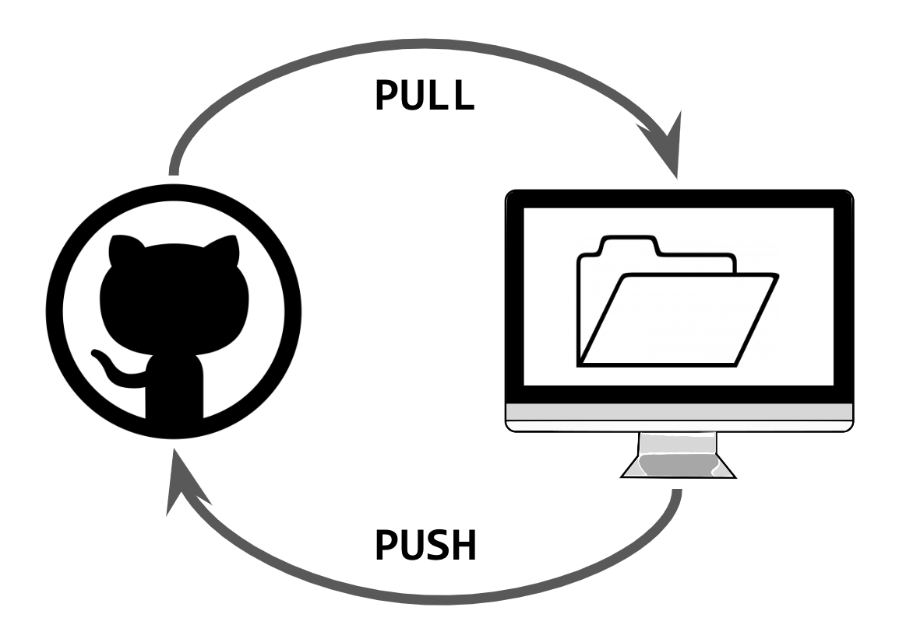{width="400"}

Typically, we want to make sure that we always follow this flow:

1.  Pull changes from GitHub (remote) to local.
2.  Make changes locally.
3.  Push changes to GitHub.

As we are going to see later in the lab, the most frustrating issues with GitHub emerge when we break this flow.

### To Branch or Not to Branch?

In my opinion, there are two kinds of workflows for GitHub. There's the quick and dirty version, and there's the long and elegant version. We just went over the Quick and Dirty version, and you've already had practice in it when submitting all of your labs for the course. Below are the differences between these two workflows (don't worry about if you don't understand what the steps mean right now; we will learn all of them in the lab).

+--------------------------------------------------------------------------+-----------------------------------------------------------------------------------+
| Quick and Dirty Version                                                  | Long and Elegant Version                                                          |
+==========================================================================+===================================================================================+
| 1.  *Pull* recent changes from GitHub to local machine.                  | 1.  Create an *issue* at GitHub                                               |
|                                                                          |                                                                                   |
| 2.  Make edits and save them                                             | 2.  *Branch* the repo at GitHub.                                              |
|                                                                          |                                                                                   |
| 3.  *Stage* and *commit* changes.                                        | 3.  *Pull* recent changes from GitHub to local machine.                       |
|                                                                          |                                                                                   |
| 4.  *Push* changes from local machine to GitHub.                         | 4.  Make edits in the new branch and save them.                                   |
|                                                                          |                                                                                   |
| *In the quick and dirty version, all of this occurs in the main branch.* | 5.  *Stage* and *commit* changes.                                                 |
|                                                                          |                                                                                   |
|                                                                          | 6.  *Push* changes from local machine to GitHub.                              |
|                                                                          |                                                                                   |
|                                                                          | 7.  Create a *pull request* at GitHub                                         |
|                                                                          |                                                                                   |
|                                                                          | 8.  Assign a reviewer to review the proposed changes and wait for their approval. |
|                                                                          |                                                                                   |
|                                                                          | 9.  *Merge* changes, while also closing the issue and deleting the branch.        |
+--------------------------------------------------------------------------+-----------------------------------------------------------------------------------+

The long and elegant version is recommended for group work as it is designed to avoid errors and ensure that collaborators are all on the same page regarding changes to files. However, occasionally when you have to make small, quick changes to a file, and it won't impact your teammate's work, it will make more sense to follow the quick and dirty workflow. The goal for today is to get practice in the **long and elegant version.**

### Repo

::: {.callout-important}
###### Question 1

Navigate to [GitHub Classroom](https://classroom.github.com) to accept the assignment. For this assignment, you will work with up to 2-3 people. Make sure everyone is in the same group.
:::


This will create a repository at GitHub called `lab-4`. You'll notice that the repository has a few files - `README.md`, `github-practice.Rmd`. 

### Clone

*Cloning* is a `git` command that copies a remote repository to your local machine. In other words, it will copy all of the project files in the remote GitHub folder to your local computer.

::: {.callout-important}
###### Question 2
Clone the repo to your RStudio environment. To do so, copy the repo's URL at GitHub. You will want to make sure you are in the main project folder when you copy this URL; it won't work if you've clicked through to any of the files. Then in RStudio click on File \> New Project \> Version Control \> Git, and paste the copied URL into the window that appears. Note what you see in the RStudio files pane after cloning the repo.
:::

Remember that cloning creates a copy of a remote repo on a local machine. In creating this project, you've copied all of the files that make up the `github-practice` repo at GitHub to your local computer. This means that you will find all of the files associated with this repo by navigating to the folder where you created the project on your computer.

It's important to note that this is not just any old folder on your computer though. By cloning, you've created a `git` folder. This means that the folder has been set up in a way where `git` can track the changes that you make to it over time, and it knows that there is a remote version of the repository somewhere that you might want to keep it consistent with. If you tried to just create a new folder on your computer, it wouldn't necessarily have these nice features.

### Issues

::: {.callout-important}
###### Question 3
Navigate back to GitHub, and click on the repo's Issues tab. Create an issue by clicking the 'New Issue' button. Title the issue: "Adding \<your name\> to the assignment." Submit the issue, and to the left of the screen, assign the issue to yourself.

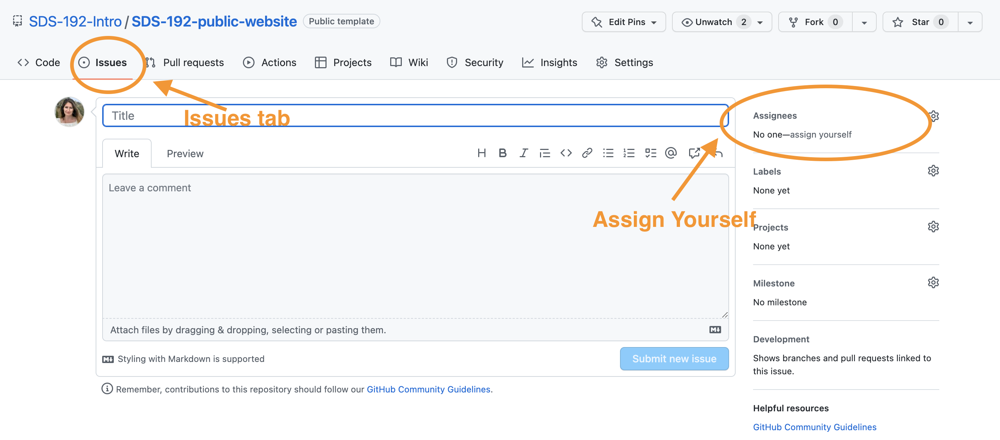{width="700"}
:::

Issues support project planning by allowing you to track changes you hope to make to your project over time. By assigning issues to certain collaborators on your project team, you can have clear documentation of who is responsible for what.

::: callout-tip
Issues can be used for a number of purposes. Issues can be assigned to bugs that are in certain coding scripts. Other times, issues can be used to track features that need to be added to code down the road. Additionally, those using code can submit issues to ask questions about how something works, to report bugs, or to request features.
:::

### Branch

When you first create a repository, all of the code will be stored in the *main* branch of the repository. If you were to think of a project like a tree growing up from the ground, then the main branch would be the like the trunk of the tree. We don't want the main branch to break because the whole tree could come down. One goal of a branching workflow in GitHub is to keep the most stable and polished versions of code in the main branch.

So what do we do in the meantime - when we're editing code, potentially breaking things, trying to sort out its bugs, and it's not quite in that stable and polished state yet? That's where branching comes in.

When we create a branch of our repo, GitHub creates a separate copy of the repo where you can make changes without impacting what's in the main branch. Later, once we're done making changes and things are stable and polished, we will have the opportunity to merge those changes back into the main branch.

Think of it another way: You write a rockstar first draft of a final paper, and you decide to send it to a few friends to review. You could just share the original document with them and tell them "Have at it! Edit away!" The problem is that, if they are making changes directly to the original document, you could lose some of that awesome original text. A better option would be to create separate copies for each teammate to edit, send them those copies, and then figure out how to layer in their edits later. This is like branching. The original document would be the main branch, and each copy sent to a friend would be a branch off of main. Friends can make as many edits as they want in their branch because you still have the original stable and polished copy. Later, we can merge their changes back into the main branch.

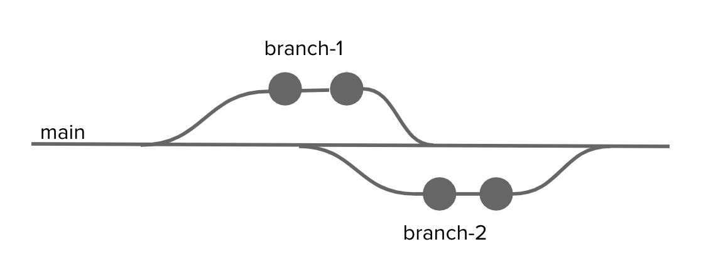{fig-alt="This shows how branches stem from the main branch and then merge back in."}

::: callout-tip
Branching can get pretty wild in GitHub. You can have branches of branches of branches. I don't recommend this. A good workflow is to create a branch for making specific changes, merge those changes back into main, delete the branch, and then create a new branch for the next batch of changes.
:::

::: {.callout-important}
###### Question 4

Click on the Code tab on your repo's page on GitHub. irectly below this tab, you will see a dropdown that is currently labeled "main." This means that you are in the main branch. Each member of your team should click the down arrow, and create a branch by entering their first name into the textbox that appears, and then clicking "Create branch."

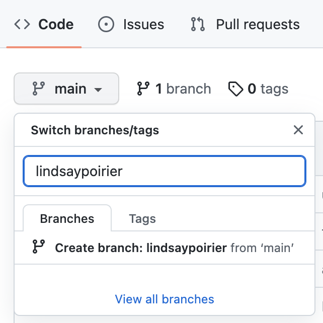{fig-alt="This demonstrates the UI to create a branch." width="300"}
:::


### Pull

As of right now, the branch that was created in the previous step only exists on GitHub; it doesn't exist yet on your local machine. To get these changes to your local machine, you need to **Pull** the changes. Remember how we said that the super fancy `git` folder knows that there is a remote version of the repository somewhere that you might want to keep it consistent with? When we pull changes to our local machines, we are basically saying, check that remote version for changes, and then pull them into the repo on my computer.

::: {.callout-important}
###### Question 5

Head back to RStudio. In the Environment pane, you will notice a tab labeled "Git." It's important to note that this tab will only appear in projects that are built from super fancy `git` folders. This is your RStudio command center for Git and GitHub. When you click on this tab, you will see a few buttons in the navigation bar. To pull changes, you should click the blue downward arrow. Click this button to pull the branches created remotely to your local machine.

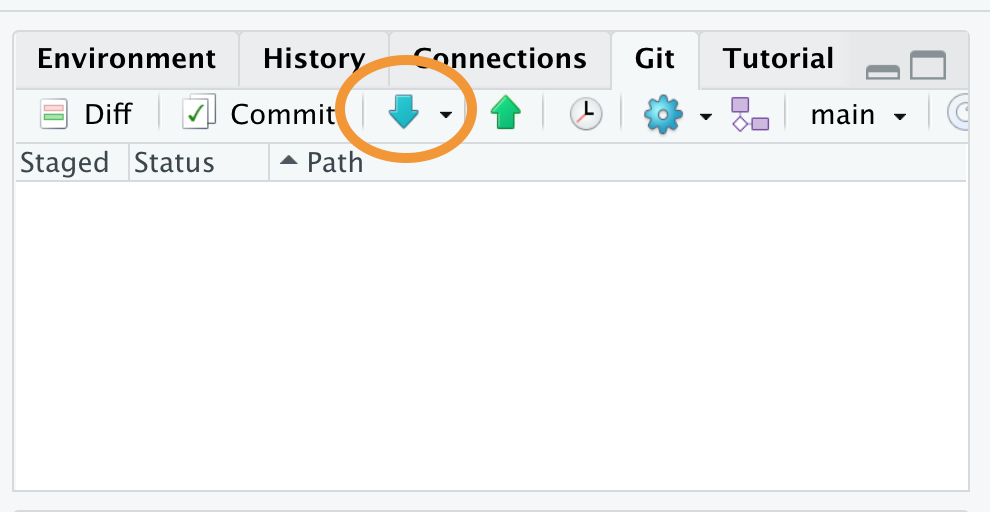{fig-alt="This highlights the pull button." width="400"}
:::

### Switch Branches

Even though you pulled the new branches to your local machine, you are still currently working in the main branch. Remember that we always want to keep the main branch stable and polished. This is not where we are going to make edits. Instead, you will make edits in the branch that you just created. Later, we will merge those changes back into the main branch.

::: {.callout-important}
###### Question 6

In the top right hand corner of the Git tab, you will see a dropdown currently set to "main". Click the downward arrow, and switch to your branch by selecting the appropriate branch.

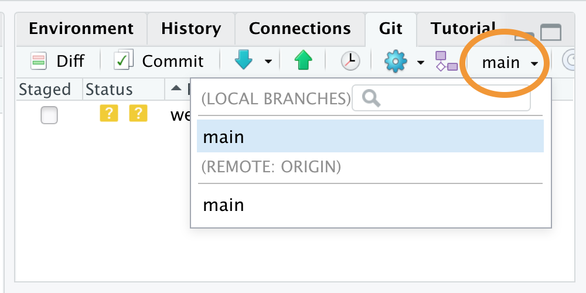{fig-alt="This highlights were to look to switch branches." width="400"}
:::

### Make Changes

::: {.callout-important}
###### Question 7

Once in your branch, open `github-practice.Rmd` from the files pane. Decide within your group who will be Group member 1, 2, 3, and so on. Each group member should edit this file on their own local machines by adding their name **and only their name** to the appropriate location in the document (line 5, 7, or 9) based on their assigned number. **It's very important that this be the only section of the document you edit.** Save the file by clicking File\>Save.
:::

### Stage

Sometimes we make a changes to a few files, save them, and we're ready to create a snapshot of our repo (i.e. create a **commit**) with some of those changes. Remember that creating this snapshot is almost like taking a photo of the repo at this particular moment, allowing us to later go back to that photo to see what the repo looked like in that moment. To let Git know which changes we want to include in that snapshot, we need to stage the files. Staging basically says, "these files are ready to be included in the snapshot."

::: {.callout-important}
###### Question 8

Once you save the file you'll notice in the RStudio Git pane that the file name appears after a blue square labeled "M" (which stands for Modified). This means that the file is ready for staging. Stage the file - indicating that it's ready for committing - by clicking the checkbox in front of the file name.

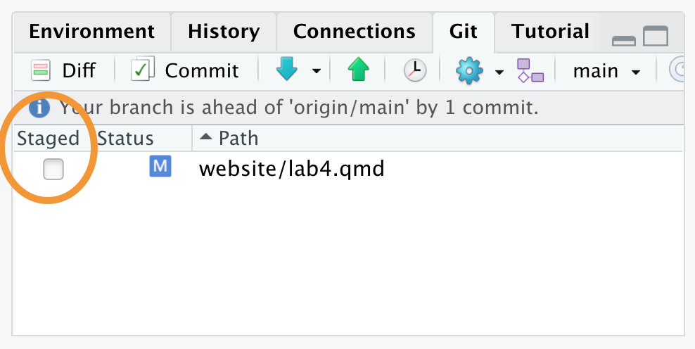{fig-alt="This highlights where to look to stage changes." width="400"}
:::

### Commit

As we just noted, committing changes basically means taking a snapshot of a repo at a particular moment in time. Commits are given unique hashes - sort of like a unique identifier that enables us to access the snapshot of the repo at a later date. In collaborative projects, it is typically recommended to commit often - after any major changes are made to a file. This ensures that we can eventually go back to look at very specific changes. It's also important to label commits with descriptive titles so that we can recall what changes within that commit. Descriptive titles should detail what changes were made in the last round of edits.

To help put this into context, think back to our photograph metaphor. Let's say that we are a photographer assigned to document how a baby develops in the first year of its life. If the photographer only took one photograph when the baby was 1 year old, we wouldn't have a lot of documentation regarding how the baby developed! ...so instead, let's say that the photographer took a snapshot of the baby after every major milestone - their first laugh, their first solid food, their first crawl, their first word. We would have a lot more to go by when trying to understand how the baby developed. Same goes for committing code often.

Now let's say the photographer handed the batch of photos to the parents, and said - "look, here's how your baby developed over time." The parents might not remember which photograph was taken after which milestone. ...but if the photographer were to label each photograph with things like "baby had first laugh," the parents would be able to easily go back to specific moments in their baby's development. This is why we want descriptive commit messages. We want to later be able to go back and scan through what changes were made after each commit.

To get a sense of what it means to be able to look back on these changes, check out the latest commits that I made to the GitHub repo for our course website. While I'm not going to claim to be the most diligent commit-er, you do get a basic sense of what changes were made to the repo following each commit from these commit messages. I could click through any of these links to see what my repo looked like at this moment in time.

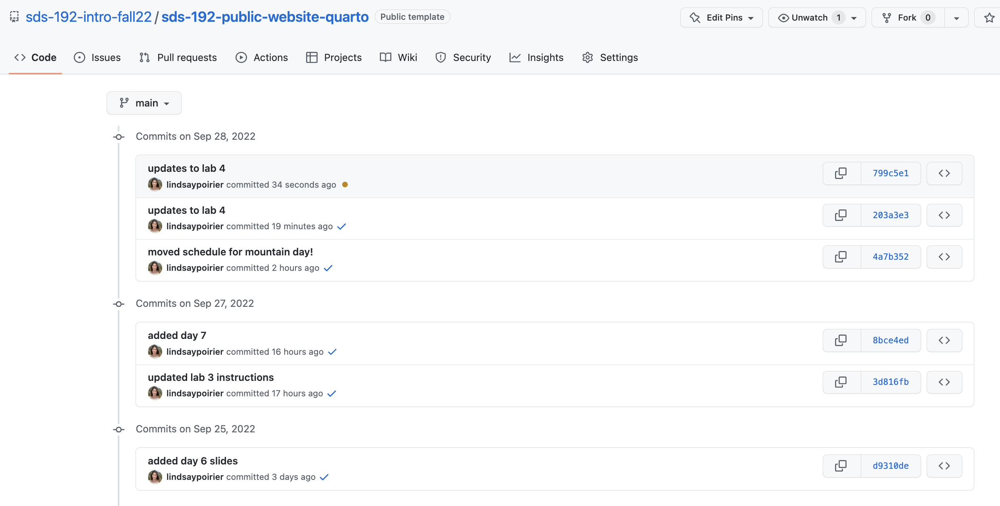{width="800"}

::: {.callout-important}
###### Question 9

Commit your changes by clicking the 'Commit' button in the Git pane. When you click this button, a new window will open showcasing the changes that have been made to the staged file. You should enter a commit message in the window that appears. Remember that commit messages should be descriptive. In this case, something like "added \<your-name\>'s name" would work. Click commit. Now a snapshot of this version of the code repo has been taken.
:::

### Push

Only your local machine knows that a change has been made to the code. Remember again how we said that the super fancy `git` folder knows that there is a remote version of the repository somewhere that you might want to keep it consistent with? Now we want to do the opposite of pulling changes from GitHub to our local machines. Instead, we want to push the changes on our local machines to GitHub.

::: {.callout-important}
###### Question 10

Click the Green upward arrow in the Git pane to push your changes to GitHub.

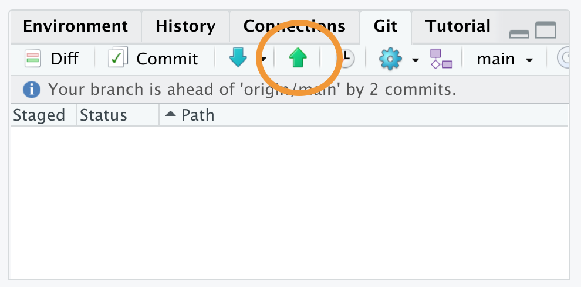{fig-alt="This highlights the push button in RStudio." width="400"}

Once all group members have pushed their changes, head back over to GitHub. On the main code page, switch between branches and check out the contents of `github-practice.Rmd` in each branch. What differences do you notice?
:::

### Pull Request

Note that now we have a few versions of our repo in separate branches on GitHub, and in each of those versions of the repo, the github-practice.Rmd file looks a little bit different. Now that we've made our changes and things are stable and polished, we want to move all of those changes into the main branch. To do this, we are going to issue a **Pull Request**. This is a request that signals to all of our collaborators that we are ready to move our changes back into the main branch.

::: {.callout-important}
###### Question 11

On your repo's page in GitHub, click the "Pull Requests" tab, and then click the green "New Pull Request" button. You're requesting to pull the changes from your personal branch into the main branch. This means that the *base* branch should be main, and the *compare* branch should be your personal branch.

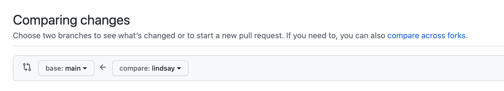{fig-alt="This shows how you should select branches when creating a pull request." width="500"}

You'll see a screen where you can compare your branch to the main branch. Click the button to "Create Pull Request," enter a descriptive title of the changes made, and then click "Create Pull Request" again.
:::

### Review Pull Requests

I recommend that you get in the habit of reviewing your collaborator's work before merging their changes into the main branch. By creating pull requests, we scaffold an opportunity to review each other's work before fully integrating the changes.

Now there should be a pull request for all members of your team. Assign one team member to review one other team member's code. All team members should have one reviewer.

::: {.callout-important}
###### Question 12
Open your own pull request in GitHub, and in the right sidebar, assign the team member responsible for reviewing your changes as a "Reviewer."

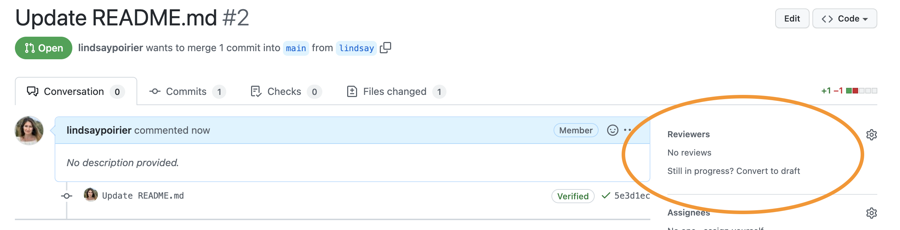{fig-alt="This shows where to add reviewers on the GitHub UI." width="500"}

Then navigate to the pull request you are responsible for reviewing. Click on the "Files Changed" tab. Note that the left side of the screen shows the previous version of the file, and the right side of the screen shows the new version of the file. Lines in red have been deleted, and lines in green have been added.

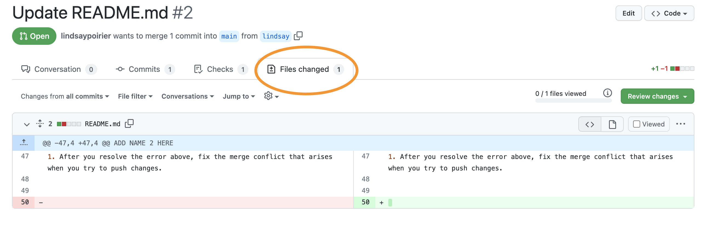{fig-alt="This shows where to find the files changed tab in GitHub." width="500"}

After looking through the changes, click the green button "Review changes." Leave a note for your collaborator, indicating your evaluation of their changes. If everything looks good, check the radio button for "Approve." If there are issues, check the radio button for "Request Changes." Then click the button to "Submit Review."
:::


::: callout-tip
If your reviewer requested changes, you should go back to RStudio, and make sure you are in your own branch. Then make the requested changes, save the file, stage the file, commit the changes, and push again. The changes to your file will be tracked in your pull request. After this, you may move on to the Merge step. See [here](https://docs.github.com/en/pull-requests/collaborating-with-pull-requests/reviewing-changes-in-pull-requests/dismissing-a-pull-request-review) for further options on dismissing or re-requesting reviews.
:::

### Merge

Once all reviewers have approved changes, we are ready to merge those changes into the main branch. Open each pull request. If everything is good and ready to merge, you will see a green checkmark that says "This branch has no conflicts with the base branch."

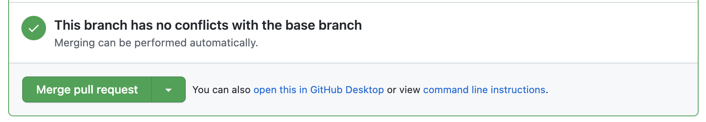{fig-alt="This shows the message you that should appear if there are no conflicts."}

(If you get a message that there are conflicts, call myself or one of the Data Assistants over.)

::: {.callout-important}
###### Question 13

Click the button to "Merge Pull Request". In the comment box that appears, enter the text "closes \#". When you enter this text, you will see a dropdown of issues and pull requests currently in the repo. Issues will have an icon that appears as a circle with a dot in the center.

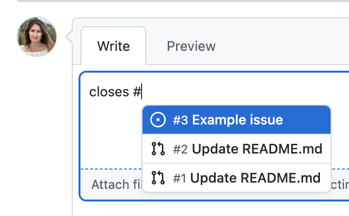{fig-alt="This shows the window that appears when you enter \"closes #\" into the comment box." width="300"}

Select the issue associated with this pull request, and then click "Confirm Merge." This will both merge the changes into the main branch and simultaneously close the issue you opened earlier. Finally, click the button to the delete the branch. Once this has been completed for all pull requests, head back over to the "Code" tab at GitHub, and check out `github-practice.Rmd`. What has happened to the file since merging the code? Navigate to the "Issues" tab. What has happened to the issues since confirming the merge?
:::


::: callout-important
## Before moving on to the next section...

You've now deleted branches at GitHub that your local machines don't know have been deleted. Before moving on to the next step, you should navigate back to RStudio and **pull** these changes to your local machine by clicking the blue downward arrow. To streamline things in the next section of the lab, we are going to work entirely in the main branch (something that I would otherwise not recommend).
:::

## Error Resolution

The workflow presented above seems to work all fine and dandy. But there are a number of factors that can impede this seamless workflow. In this final section of the lab, we will go over three kinds of errors that you might come across in the workflow above, and talk about how you would resolve them. I can almost guarantee that you will deal with some of these issues when working on your group projects, so I would encourage you to keep this lab handy when engaging in project work.

### Push error

A push error occurs when we make changes to files on our local machines, and go to commit and push them to GitHub, but other changes had already been made to the file at GitHub that were not yet pulled into our local environments. We get an error because our local repo is inconsistent with the remote repo. **To fix this error, we need to pull changes to our local machine, and try committing and pushing again.** Let's replicate this error:

::: {.callout-important}
###### Question 14

One of your partners should navigate to the GitHub repository. Click on the file README.md. Click the pencil icon to edit the file. Replace the text: ADD NAME 1 HERE ADD NAME 2 HERE, and so on with your names. Scroll to the bottom of the page and commit changes noting in the message that your names were added.

Other partner: Return to RStudio. **Do not pull changes yet.** Open `github-practice.Rmd`. On line 40 change the `ncol()` function to `dim()`. Save the file. Stage and commit your changes. Click the green upward arrow to push your changes. You should get an error that looks like this.

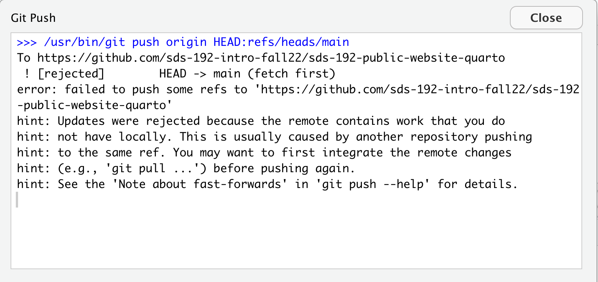{fig-alt="This shows the text that we see when we get a push error. It says hint: Updates were rejected because the remote contains work that you do hint: not have locally. This is usually caused by another repository pushing hint: to the same ref. You may want to first integrate the remote changes hint: (e.g., 'git pull ...') before pushing again."}

Follow the steps above to resolve the error.
:::

An easy way to avoid a push error is to always click the blue downward arrow to pull remote changes before starting to edit files on your local machine.

### Pull error

A pull error occurs when changes have already been made to the same location (the same line number) in both a remote file and a local file, and then we try to pull the changes from the remote repo to our local machines. As far as Git can tell, there are two options for what this line is supposed to look like, and it can't tell which to prioritize. So Git recommends that, as a first step, we commit the changes that we made locally. It's basically saying, let's take a snapshot of your local repo as it looks right now, so that later we can figure out what to do about this conflict.

If this seems confusing imagine this: let's say you write a paper, and you share it with one of your classmates to review. The classmate reads through it, makes suggested changes to the opening sentence, and sends it back you. ...but, while your classmate was reviewing the paper, you were getting antsy about the paper deadline and started making your own edits to the paper, including edits to the opening sentence. Now you're trying to incorporate the changes from your classmate's review, and you're not sure what to do about that opening sentence. As a first step, you have two options you can scrap your recent changes (maybe your classmate's suggestions were better!) or you can save a separate copy of the file with your recent changes and figure out later how to resolve the differences. That's exactly what we are going to do here:

**To fix this error, you should stage and commit your local changes and then try pulling again.** Let's replicate this error:

::: {.callout-important}
###### Question 15

One of your partners should navigate to the GitHub repository. Click on the file `github-practice.Rmd`. Click the pencil icon to edit the file. Replace the code on line 47 with the following: `colnames(pioneer_valley_2013).`

Scroll to the bottom of the page and commit changes noting in the message how you updated the function.

Other partner: Return to RStudio. **Do not pull changes yet.** Open `github-practice.Rmd`. Replace the code on line 47 with the following: `ncol(pioneer_valley_2013)`

Save the file. Click the blue downward button to Pull changes. You should get an error that looks like this.

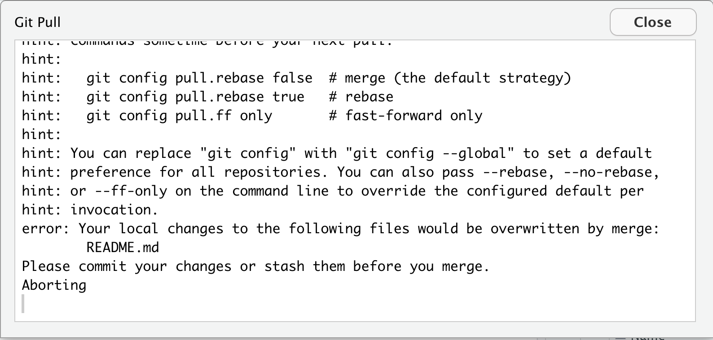{fig-alt="This shows the error message we get for a pull error. It says \"error: Your local changes to the following files would be overwritten by merge:    README.md Please commit your changes or stash them before you merge.\""}

Follow the steps above to resolve the error.
:::

### Merge conflict

So now we have these two snapshots of github-practice.Rmd, and they are in conflict with one another. If we try to push our changes back to GitHub, Git is not going to know what to do. Should the file at GitHub look like the version currently at GitHub, should it look like the snapshot that we just commit to our local machines, or should it look like something else entirely?

Let's return to the example of trying to incorporate a peer's edits to a paper that you have recently made changes to. We have to figure out what to do about that opening sentence. Do we want our version, their version, or some combination of the two? This is what it is like to fix a merge conflict.

**To fix this error, open the file with conflicts and edit the lines with conflict.**

::: {.callout-important}
###### Question 16
One of your partners should try to pull changes by clicking the blue downward arrow in RStudio. You will get an error that looks like this:

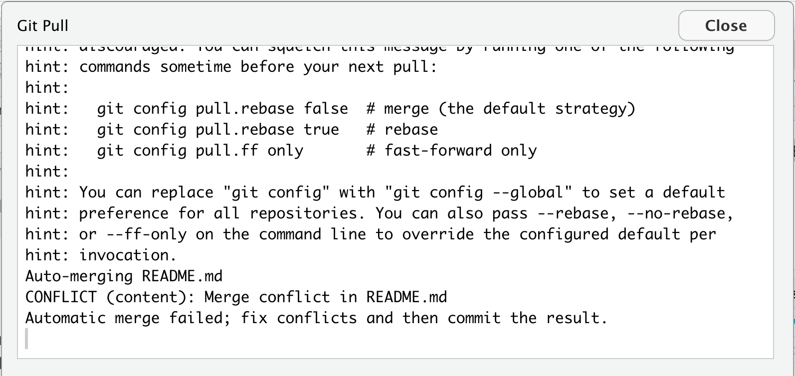{fig-alt="This is the window that we see when we get a merge conflict. It says: CONFLICT (content): Merge conflict in README.md}

To fix this one your partners should open the file with the conflict. In this case it will be `github-practice.Rmd`. Scroll to the section of the file with the conflict. It will now look something like this:

```         
    <<<<<<< HEAD

    ncol(pioneer_valley_2013)

    =======

    colnames(pioneer_valley_2013)

    >>>>>>> ee175895783b64e0e1f696d9456be4c4c7c3f3bf
```

The code following HEAD represents the recent changes you made on your local machine, and the code right before the long string of characters represents the changes that were made in an earlier commit (the long string of characters is the commit hash). Decide what that line should look like and delete all other content. This means you *must* delete "\<\<\<\<\<\<\< HEAD", "=======", and "\>\>\>\>\>\>\> \<long-hash\>", and you likely should delete at least one other line. Save the file, stage the file by clicking the checkbox next to the file in the Git page, and then commit your changes, and push them to GitHub.
:::

::: callout-tip
## Avoiding Merge Conflicts

You may have noticed that the most frustrating merge conflicts tend to emerge when we have two people working on the same line of a repo's file. The most effective way to avoid merge conflicts is to ensure that collaborators are working on different documents or different lines in a file. One way you might do this when starting to work on your group project is to open a file that you all plan to work on and having one of your team mates section off space of that file for different people to work. It might look something like this:

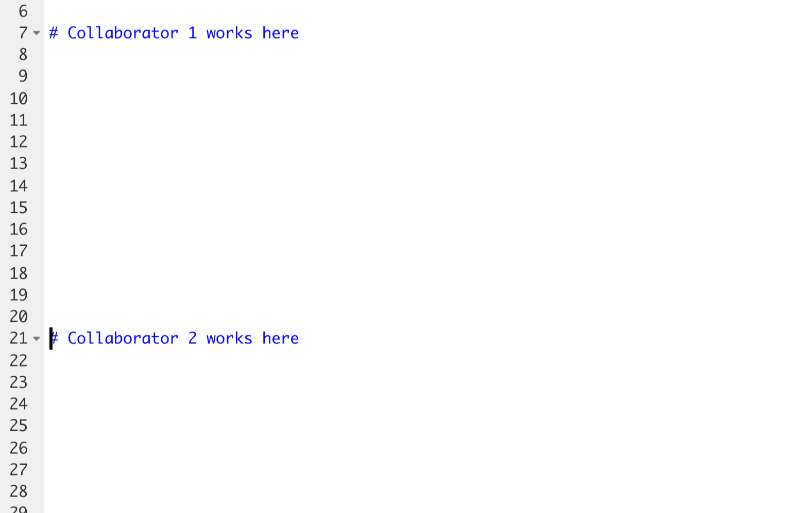{fig-alt="This image show an RMarkdown file with several lines for Collaborator 1 to work and several more lines for Collaborator 2 to work." width="300"}

Once this change has been made, that group mate should stage, commit, and push the file to GitHub, and all other group mates should pull the change to their local machines.
:::

### Path of Least Resistance

I have been working with GitHub for years, and even to this day, I run into instances where things become so inconsistent between my local machine and the repo at GitHub that the fastest way to fix things is just to save local copies of the files that I've changed to somewhere else on my machine, delete the super fancy Git folder from its current location, and then re-clone the most up-to-date remote version to my local machine. Then I can figure out how I want to edit the most up-to-date version with my changes. This comic from XKCD captures this widely acknowledged solution beautifully:

{fig-alt="This is a comic explaining why we sometimes just delete our local git repos and reclone."}

::: callout-caution
## Ethical Considerations

Increasingly, when data science researchers publish a paper in a journal, they are making the code they used to reach certain results freely available on GitHub for other researchers and the public to review. This is in part a response to the reproducibility crisis that you learned about in SDS 100. What do you see as the social benefits to making the code behind a data science finding publicly available online? What might be some of the social consequences of making this code freely available? How might we mitigate these consequences? Share your ideas on our `discussions` Slack channel.
:::
