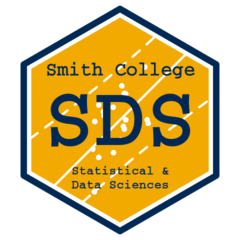
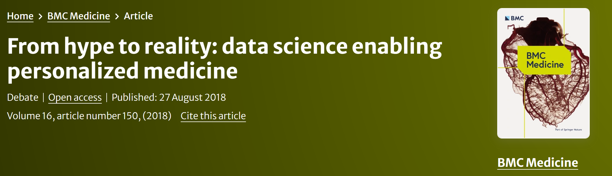
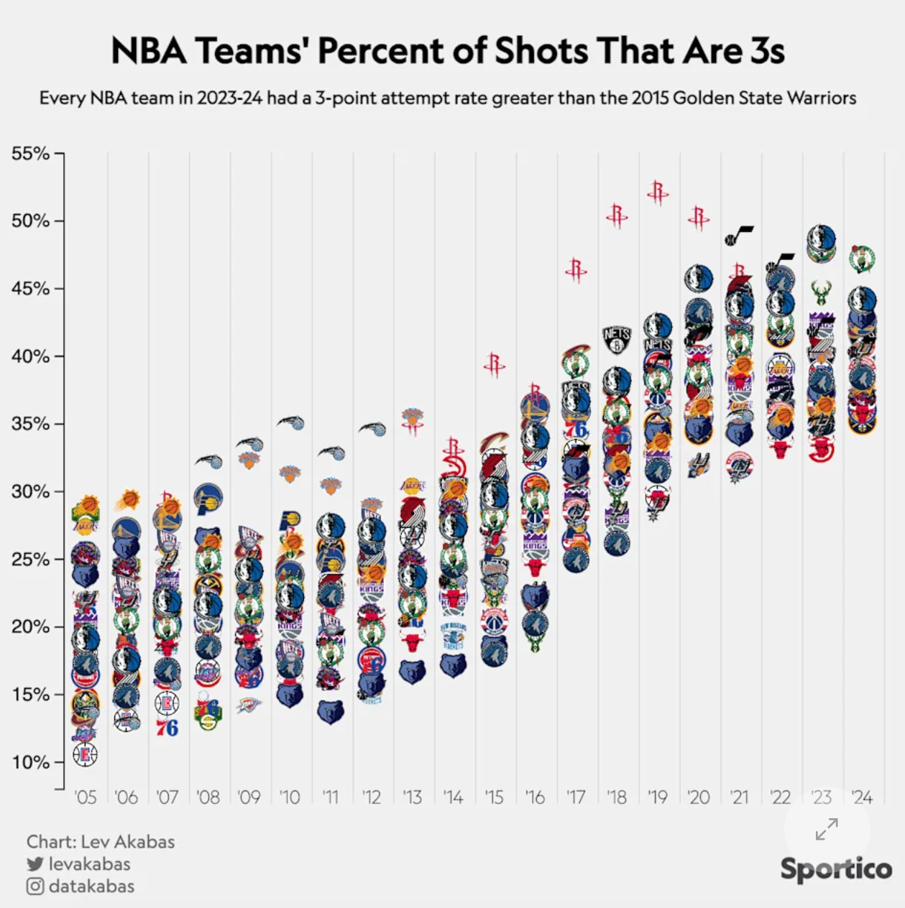
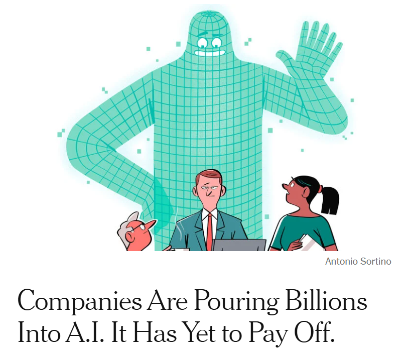
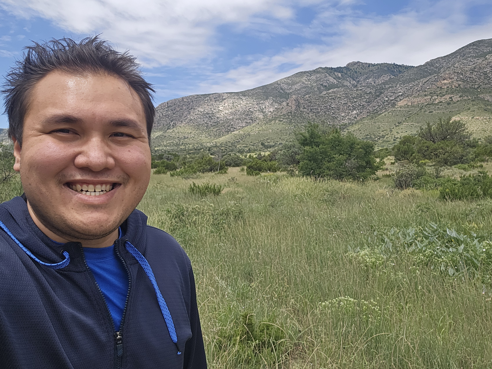

## Welcome!

::: columns
::: {.column width="40%"}

{fig-align="center"}

:::
::: {.column width="60%"}

- **Course:** SDS 192
- **Times:**
  - 01: Mon/Wed/Fri 9:25-10:40am
  - 02: Mon/Wed/Fri 10:50-12:05am

:::
:::

## Welcome!

::: columns
::: {.column width="60%"}

- **Instructor:** Jericho Lawson  
- **Location:** McConnell 211  
- **Office Hours:** 
  - Wed 2-3:30pm
  - Thurs 1-2:30pm
- **Email:** [jlawson01@smith.edu](mailto:jlawson01@smith.edu)

:::
::: {.column width="40%"}

{fig-align="center"}

:::
:::

## 

{fig-align="center" width=65%}

::: columns
::: {.column width="45%"}

{fig-align="center" width=70%}

:::

::: {.column width="55%"}

{fig-align="center" width=65%}

:::
:::

## Activity: Data Science

Form groups of 2-3 with your peers near you. Complete the following tasks:

1. Introduce yourselves to each other! Mention your name, major, and one cool thing you did over the summer.
2. On a piece of paper, write the names of all group members.
3. Write down words, phrases, and ideas that come to mind when you hear "data science".

## What is data science? Common view:

::: columns
::: {.column width="60%"}
-   Interdisciplinary field combining computer science, mathematics/statistics, and domain expertise to extract meaningful information from unstructured data points
:::

::: {.column width="40%"}
{width="400"}
:::
:::

------------------------------------------------------------------------

## What is data science? My view:

::: columns
::: {.column width="60%"}
- Interdisciplinary field combining computer science, mathematics/statistics, and domain expertise to extract meaningful information from unstructured data points
-  Includes the human aspect: use of aesthetics, situational context, and communication to explain the data to the world
:::

::: {.column width="40%"}
{width="400"}
:::
:::

------------------------------------------------------------------------

## Case Study 1: ACLU Fights Discriminatory Housing {.smaller}

::: columns
::: column
-   American Civil Liberties Union employs [data scientists](https://medium.com/aclu-tech-analytics/meet-the-aclu-analytics-team-4644d4f20dae) to produce insights regarding discriminatory laws and practices
-   Findings are presented in courts, legislatures, and public reports
-   In [this study](https://www.aclu.org/blog/racial-justice/race-and-economic-justice/lawsuit-challenges-discriminatory-housing-policy), they use public data to show that excluding people with criminal records from housing can be viewed as a violation of the US Fair Housing Act.
:::

::: column

:::
:::

------------------------------------------------------------------------

## Case Study 2: EPA Tracks Environmental Injustice {.smaller}

::: columns
::: column
-   Environmental Protection Agency hires [data scientists](https://www.epa.gov/careers/science-careers-epa) to produce insights regarding environmental health risks
-   Findings implicate environmental policies, funding allocations, and legal actions against states and industries
-   [This tool](https://www.epa.gov/ejscreen), visualizes environmental and demographic indicators to highlight communities experiencing environmental injustices.
:::

::: column
{width=80%}
:::
:::

------------------------------------------------------------------------

## Case Study 3: Geena Davis Institute Studies Gender Biases in Films {.smaller}

::: columns
::: {.column width="60%"}
-   Geena Davis Institute collaborated with University of Southern California's Signal Analysis and Interpretation Laboratory (SAIL)
-   Developed a machine learning tool to measure representation of diverse groups in films by studying screen time and speaking
:::

::: {.column width="40%"}
{width="100%"}
:::
:::

------------------------------------------------------------------------

## Topics covered in this course

::: columns
::: {.column width="70%"}
-   Data visualization
-   Data wrangling
-   Programming with data (via R)
-   Data retrieval
-   Data science infrastructures and workflows
-   Data science ethics
-   Mapping
:::

::: {.column width="30%"}

:::
:::

## Learning objectives

**Data visualization** 

- Create informative and clean visuals via base R, advanced libraries
- Show appropriate statistics and metrics for support

**Data wrangling** 

- Develop proper wrangling techniques, including data transformation, cleaning, and joining
- Gather data in appropriate and ethical manners

## Learning objectives

**Workflow**

- Practice retrieval, R programming, GitHub, and light statistics

**Data ethics**

- Identify best practices and ethical dilemmas, including contextual thinking, environmental concerns, and intellectual property
- Develop ethical ways to use generative AI

------------------------------------------------------------------------

## Who am I? {.smaller}

Call me Jericho, but if you prefer, Professor Lawson or Dr. Lawson is okay!

::: columns
::: {.column width="30%"}

{fig-align="center"}

:::
::: {.column width="70%"}

- (Visiting) Lecturer of Statistical and Data Sciences
- Just finished my Ph.D. in Applied Statistics at UC Riverside!
- Research interests: variable selection, imaging, machine learning
- My college journey:
  - M.S. in Statistics at UC Riverside
  - B.S. in Applied Mathematics; Statistics and Data Science from University of Arizona
  
::: 
:::

## Who am I? {.smaller}

::: columns
::: {.column width="30%"}

{fig-align="center"}

:::
::: {.column width="70%"}

- Out of class:
  - A big hiker, foodie, and explorer!
  - Basketball, tennis, football, etc.
  - Let me know of any recs you have around Northampton!
  
::: 
:::

------------------------------------------------------------------------

## Exercise

On your feet! 

1. Think about how many cups of coffee you had before going into class?
2. Group yourselves based on the number of cups you've had.

------------------------------------------------------------------------

## Workflow

- Determine problem/issue 
- Collect data
- Explore and clean the data
- Model the data
- Communicate results

**Question?** How was this done? Discuss amongst yourselves.

## Tools

- **Determine problem/issue:** Exploration of issues
- **Collect data:** From online source (e.g. scraping, csv file)
- **Explore and clean the data:** Use of R, wrangling
- **Model the data:** Statistics, regression
- **Communicate results:** Plots, tables, writing, presentations

## Coding: agonizing when it doesn't work, satisfying when it does

- Think of code like a language. 
- Coding can be incredibly frustrating.
- Coding has been exclusionary.

------------------------------------------------------------------------

## Prepping for this class

- Navigate the Moodle course website
- Read through the syllabus
- Perusall
- Slack

------------------------------------------------------------------------

## For Monday

- Install Slack desktop and set notifications
- Read through article and make annotations on Perusall
- Read through Ch. 1-2 of textbook and syllabus
- Take reading/syllabus quiz on Moodle
- Complete the pre-course survey on Moodle
- Bring charged laptop to class on Monday

