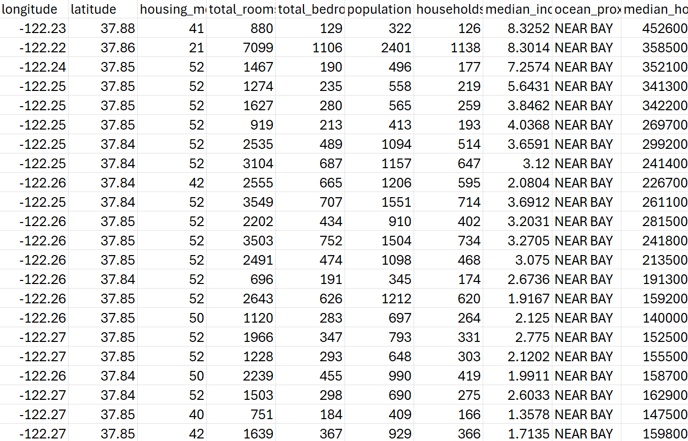

## What is a dataset?

## What is a dataset?

- Collection of data points organized into a structured format
- In this course, we will mainly work with datasets that are structured in a two-dimensional format
  - These are referred to as **rectangular** datasets
- Rectangular datasets are organized into a series of rows and columns; ideally:
  - We refer to rows as **observations**
  - We refer to columns as **variables**

## What is a dataset? (cont.)

Grolemund, Garrett, and Hadley Wickham. n.d. R for Data Science. Accessed March 31, 2019. https://r4ds.had.co.nz/.

## Collecting and organizing data

- Involves a research question we're trying to answer
  - e.g. What factors are contributing to a decrease in a bird species?
  - Experimental vs. observational
- Determine a sample, observation units, and variables to gather
- In most cases: can be formed into a rectangular format
  - Rows represent the observations
  - Columns represent the variables

------------------------------------------------------------------------

## Observations vs. Variables vs. Values {.smaller}

::: panel-tabset
### Observations

::: nonincremental
-   Observations refer to *individual units* or cases of the data being collected.
    -   If I was collecting data about each student in this course, one student would be an observation.
    -   If I was collecting census data and aggregating it at the county level, one county would be an observation.
:::

### Variables

::: nonincremental
-   Variables describe something about an observation.
    -   If I was collecting data about each student in this course, 'major' might be one variable.
    -   If I was collecting county-level census data, 'population' might be one variable.
    -   Can be categorical or numerical
:::

### Values

::: nonincremental
-   Values refer to the actual value associated with a variable for a given observation.
    -   If I was collecting data about each student's major in this course, one value might be SDS.
:::
:::

------------------------------------------------------------------------

### Referring to rows, columns, and values

- An *index* is a formal way of identifying the data at certain positions in a dataset.
- Indexes/indices are usually formatted as two numbers in brackets (e.g. \[3,4\]).
  - First number: row position
  - Second number: column position
  - e.g. \[3, 4\] will refer to the value three rows down and four rows over.
  
------------------------------------------------------------------------
  
### Referring to rows, columns, and values (cont.)

- A *row* can be referenced by removing the value in the column (second) position
  - e.g. \[3, \] refers to third row
  - Syntax seen in R, can depend in other coding languages
- A *column* can be referenced by removing the value in the row (first) position
  - e.g. \[, 4\] refers to fourth column
  - Syntax seen in R, can depend in other coding languages

------------------------------------------------------------------------

## Key Considerations for Rectangular Datasets {.smaller}

::: columns
::: column
-   All rows in a rectangular dataset are of equal length.

-   All columns in a rectangular dataset are of equal length.

::: callout-note

### Understanding Check

Let's say I have a rectangular dataset documenting student names and majors, and I was missing major information for one student. What would this look like in a rectangular dataset?
:::
:::

::: column

Grolemund, Garrett, and Hadley Wickham. n.d. R for Data Science. Accessed March 31, 2019. https://r4ds.had.co.nz/.
:::
:::

------------------------------------------------------------------------

## How do I find out more information about a dataset? {.smaller}

::: nonincremental
-   Metadata can be referred to as "data about data"
-   Metadata provides important contextual information to help us interpret a dataset.
-   There are two types of metadata associated with datasets:
:::

::: panel-tabset
### Administrative

::: nonincremental
-   Administrative metadata tells us how a dataset is managed and its *provenance*, or the history of how it came to be in its current form:
    -   Who created it?
    -   When was it created?
    -   When was it last updated?
    -   Who is permitted to use it?
:::

### Descriptive

::: nonincremental
-   Descriptive metadata tells us information about the contents of a dataset:
    -   What does each row refer to?
    -   What does each column refer to?
    -   What values might appear in each cell?
:::
:::

------------------------------------------------------------------------

## Where do I find metadata for a dataset? {.smaller}

-   Often times, metadata is recorded in a dataset codebook or data dictionary.
-   These documents provide definitions for the observations and variables in a dataset and tell you the accepted values for each variable.
-   Let's say that I have a dataset of student names, majors, and class years. A codebook or data dictionary might tell me that:
    -   Each row in the dataset refers to one student.
    -   The 'Class Year' variable refers to "the year the student is expected to graduate."
    -   Possible values for the 'Major' variable are Political Science, SDS, and Sociology.

------------------------------------------------------------------------

## Types of variables

Variables can fall into one of two different types:

- Categorical: variable can be split into discrete groups/factors
  - Nominal: named or classified labels *with no inherent order*
  - Ordinal: ordered labels
- Numerical: variable defined by a set of numbers
  - Discrete: countable
  - Continuous: measured
  
## Types of variables (cont.)

- **Question:** Provide examples of each of the four sub-types of different variables. 

------------------------------------------------------------------------

## Group activity (to turn-in)

- Navigate to the "Class #2: Activity" on Moodle
- Work in groups to answer the questions on a sheet of paper

------------------------------------------------------------------------

## For Wednesday

- Work on Tech Setup
- Work on Problem Solving lab (optional)
- Wednesday's class: Basics of R