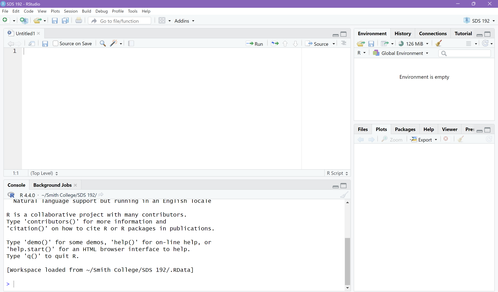
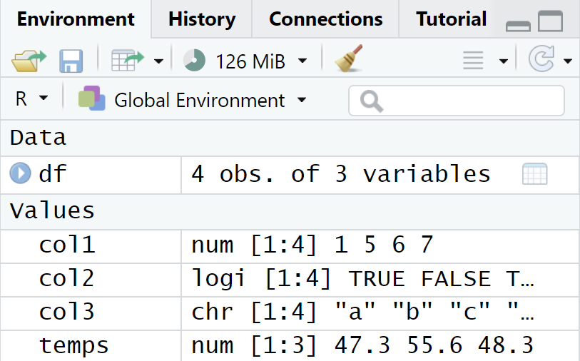

## Last Time

- Data fundamentals
  - Rectangular datasets
  - Observations, variables, and values
  - Categorical vs. discrete

## Today

- Welcome to `R`!
  - Interface
  - Basics
- Coding in `R`
  - "hello world!"
  - Objects and data structures
  - Operators and functions
- Time to setup GitHub classroom; problem-solving lab

------------------------------------------------------------------------

## R and RStudio

- R is the coding language we are using for all things data science related
- RStudio is the interface (i.e. IDE) we are using to access R
- If you haven't installed both yet: follow these instructions [here](https://jericholawson.github.io/sds192/f25/installR.pdf)

## RStudio Interface



## RStudio Interface (cont.) {.smaller}

::: columns
::: {.column width="50%"}
- **Script:** top-left corner of screen; used to write in files
  - Quarto (.qmd) files
- **Console:** bottom-left corner; execute single-line commands
  - Good for testing
:::
::: {.column width="50%"}
- **Environment:** top-right corner; can see objects placed in memory
  - Data frames, values, etc.
- **Help/Plots/Viewer/etc.:** bottom-right corner; used for supplemental tools
  - Can see plots, look through help files, etc.
::: 
::: 
  
## A classic first project in coding

```{r}
print("Hello world!")
```

## R is so much more than "Hello world!"

- Coding language for statisticians and data scientists
  - Python, Julia are catching up
  - [TIOBE index](https://www.tiobe.com/tiobe-index/)
- Data visualization, wrangling, and analysis
- Syntax -- think of it like learning a new language!

------------------------------------------------------------------------

## Structure

- Nouns: objects
- Verbs: functions, operations

# Data Objects in `R`

------------------------------------------------------------------------

## Values vs. Vectors vs. Data Frames {.smaller}

::: panel-tabset
### Values

::: nonincremental
-   a single data point
-   `R` understands values to be of a certain **type**:
    -   double: 3.29
    -   integer: 3
    -   character: "SDS 192"
    -   logical: TRUE/FALSE
    -   date-time: 1/23/84 01:23:01
:::

```{r}
3.29 # double
3L # integer
"SDS 192" # character
TRUE # logical
Sys.Date() 
```

### Vectors

::: nonincremental
-   a 1-dimensional data object, listing a series of values
-   all objects in a vector share the same **type**
-   vector defined by listing entries (separated by commas) in the function `c()` (shorthand for *concatenate/combine*)

```{r}
c(1, 2, 3, 4)
c("Northampton", "Hadley", "Easthampton", "Amherst")
```
:::

### Data Frame

::: nonincremental
-   a two-dimensional (rectangular) data object
-   Every column in a data frame is a vector
-   Column names act as a variable name for that vector (access via the `$` accessor)

```{r}
#| echo: false
col1 <- c(1, 5, 6, 7)
col2 <- c(TRUE, FALSE, TRUE, TRUE)
col3 <- c("a", "b", "c", "d")
df <- data.frame(col1, col2, col3)
```

```{r}
df
df$col1
```
:::
:::

------------------------------------------------------------------------

## Assigning Objects to Variable Names {.smaller}

- `<-` symbol assigns a value to a variable
  - `=` is okay, but not preferred
- Stores object for future use
- Variable names should be short, descriptive, and snake-cased (lower-cased with words separated by underscores)
  - e.g. `urban_data` for a dataset that refers to demographic data in a city
  - e.g. `test_scores` for a vector of test scores from a particular class
  - Avoid periods, use separator characters (_), and do not start variables with numbers

------------------------------------------------------------------------

## Learning check

What kind of object is this in `R`? What is its type?

```{r}
temps <- c(47.3, 55.6, 48.3)
```

------------------------------------------------------------------------

## Learning check

What would happen if I were to do the following in `R`?

```{r}
val <- 34
val <- val + 1
```

- This is called *overwriting* a variable.

------------------------------------------------------------------------

## Where can I find these data objects in `R`?

::: columns
::: {.column width="50%"}
- Objects in `R` will be listed in the Environment tab in the upper right hand corner of RStudio.
- Removing unnecessary objects from the environment can free up space!

```{r}
rm(temps)
```
:::

::: {.column width="50%"}

:::
:::

## Other Data Structures

- `list`: used to store objects of various types

```{r}
list("autumn", c(2, 4, 6), TRUE, mtcars[1:2, 1:4])
```

## Other Data Structures

- `matrix`: 2D data structure used to store values of same type
  - Not a `list` of vectors (e.g. data frame)
  - Used for matrix operations

```{r}
matrix(c(1, 3, 7, 6), nrow = 2, ncol = 2, byrow = TRUE)
```

# Operators and functions in `R`

------------------------------------------------------------------------

## Activity: Mathematical operators

- Think and write down all possible operations you would do inside an algebra class. 

## Operators in `R` {.smaller}

- Symbols that communicate what operations to perform in `R`
- Includes calculator symbols: `+`, `-`, `*`, `/`
  - `^` or `**` for exponentiation
  - `%%` for mod (remainder of a quotient of two numbers)
- Includes relational symbols: `<`, `<=`, `>`, `>=`
  - `==` for equivalence
  - `!=` for non-equivalence
- Includes logical symbols: `&` (AND), `|` (OR), `!` (NOT)

------------------------------------------------------------------------

## What is a function?

- An action done on an object to produce something
  - Inputs/arguments to outputs
  - e.g. `y = f(x)`
  - e.g. With \$15, I bought a slice of pizza for \$5. Now I have \$10 left.
  
## Structure of Function

```{r}
function_name <- function(input1, ...){
  # action to input
  # return an output with return(__)
}
```

- **Arguments:** inputs needed to complete action
- **Actions:** what is being done to return an output
- **Outputs:** the final product

## Example of Function

```{r}
pizza <- function(money){
  money <- money - 5
  return(money)
}
pizza(15)
```

## Finding Help

- Typing `?FUNCTION_NAME` in to the Console loads info about that function

`?round()`

- What functions are required?
- What functions are optional?

------------------------------------------------------------------------

## Learning check

Convert the following variable name into something descriptive in snake case


```{r}
a <- round(pi, digits = 2)
```

Run the code in your Console. How can we find this variable in RStudio once we run this code?


# Helpful Functions in `R`

------------------------------------------------------------------------

## Helpful Value Operations

::: panel-tabset
### Numeric Values

::: nonincremental
`R` can work just like a calculator!

```{r}
a <- 2
b <- 3

sum(a,b)
```

Why does this produce an error?

```{r}
#| error: true
c <- "3"
sum(c, c)
```
:::

### Character Values

::: nonincremental
`R` can concatenate strings!

```{r}
word1 <- "Harry"
word2 <- "Sally"
paste("When", word1, "Met", word2, sep = " ")
```
:::
:::

------------------------------------------------------------------------

## Helpful Vector Functions

::: panel-tabset
### All Vectors

::: nonincremental
-   `class()` returns the class of the values in a vector
-   `length()` returns the number of values in a vector
-   `is.na()` for each value, returns whether the value is an `NA` value
:::

### Numeric Vectors

::: nonincremental
-   `sum()` returns the sum of the values in a vector
-   `max()` returns the maximum value in a vector
-   `rank()` returns the ranking of a value in a vector
- `R` has other functions for accomplishing statistical, mathematical, and ordering operations
:::

### Categorical Vectors

::: nonincremental
- `unique()` returns the unique values of a vector
- `table()` returns the distribution of unique values of a vector
:::
:::

------------------------------------------------------------------------

## Learning Check

How would I find the sum of the third column in this data frame, which I have named `df`?

```{r}
#| echo: false
df <- data.frame(col1 = c(1, 5, 7),
                 col2 = c(2, 4, 6),
                 col3 = c(3, 6, 9))
df
```

------------------------------------------------------------------------

## Helpful Data Frame Functions

-   `View()`: Opens a tab to view the data frame as a table
-   `head()`: returns first six rows of dataset
-   `names()`: returns the dataset's column names
-   `nrow()`: returns the number of rows in the dataset
-   `ncol()`: returns the number of columns in the dataset

------------------------------------------------------------------------

## Do I really have to memorize all of these functions?!

-   No. There are cheatsheets! See [this cheatsheet](https://iqss.github.io/dss-workshops/R/Rintro/base-r-cheat-sheet.pdf) for Base `R`.
- "What about ChatGPT?"
  - Fine for looking up specific function (like you would with Google)
  - Not fine for completing a task with said function

## Pipe Operator in `R` {.smaller}

- Symbol is `|>` (old version is `%>%`)

##### Without Pipe
- Functions are nested as arguments in `R`
- `length(unique(df$col1))`
- Perform the innermost function to the outermost

##### With Pipe
- Functions are sequenced in `R`
- `df$col1 |> unique() |> length()`
- Take this data object, and then perform this function, and then perform this function

# Missing Values and `R` Functions

------------------------------------------------------------------------

## Missing Values {.smaller}

-   Remember that missing values still have a position in rectangular datasets
-   Missing values get recorded as `NA` in R
-   ...but sometimes analysts put words or numbers in their datasets to indicate missingness:
    -   "NONE"
    -   -999
    -   "" \<- this is the most challenging to uncover!
-   ...but what happens when we try to perform functions on vectors that contain missing values?

------------------------------------------------------------------------

## Missing Values in Math Functions

We can use `na.rm = TRUE` to ignore NA values in math functions.

```{r}
vals <- c(1, 2, NA, 4, NA, 6)
sum(vals)
sum(vals, na.rm = TRUE)
```

## For now and Friday

- Work on Tech Setup
- Work on Problem Solving lab (optional)
- Friday's class: Lab \#1

