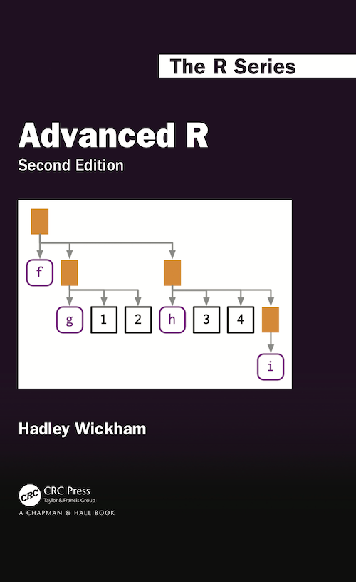
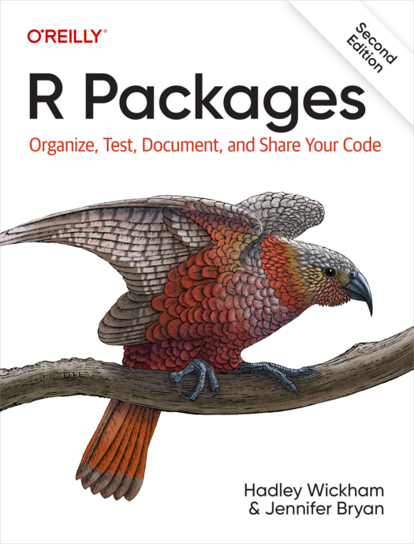
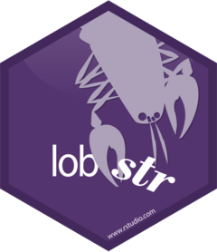
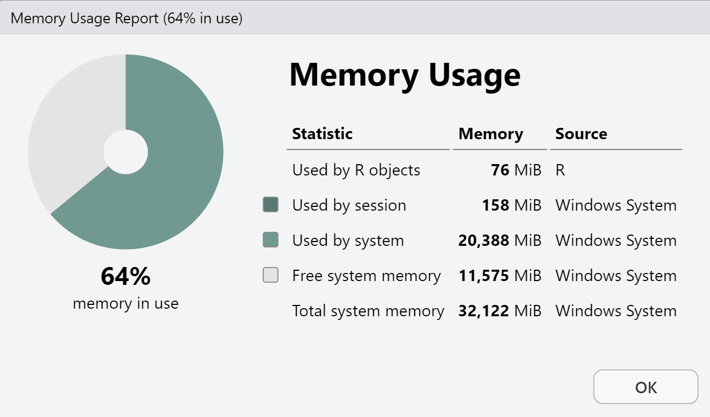
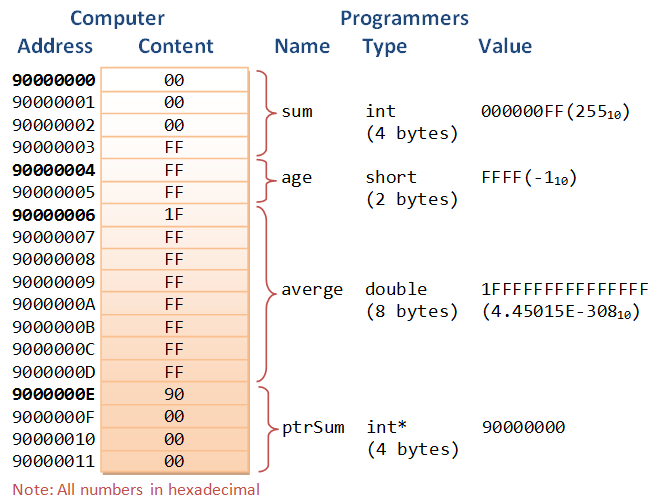

## Welcome!

::: columns
::: {.column width="40%"}

{fig-align="center"}

:::
::: {.column width="60%"}

- **Course:** SDS 270
- **Times:**
  - 01: Tues/Thurs 2:45-4pm

:::
:::


## Welcome!

::: columns
::: {.column width="60%"}

- **Instructor:** Jericho Lawson  
- **Location:** McConnell 211  
- **Office Hours:** 
  - Wed 2-3:30pm
  - Thurs 1-2:30pm
- **Email:** [jlawson01@smith.edu](mailto:jlawson01@smith.edu)

:::
::: {.column width="40%"}

{fig-align="center"}

:::
:::

## What you've done!

- Data wrangling (i.e. `dplyr`)
- Data visualization (i.e. `ggplot2`)
- Universal programming concepts
- Data types
- Some structures in R (i.e. functions, if/else statements)
- Basic version control (i.e. GitHub)

## What you will do!

- Write deeper-level R code
  - e.g. regex, functions, objects
- Contribute to open-source software through collaborative work
  - GitHub for pull requests and code review
- Make code readable, efficient, and robust
  - Through debugging and proper usage
- Create a software package in R

## Structure

- Lectures
  - Daily practice (via exercises/labs)
  - Demos
  - Bring your computer!!
- Outside class
  - Readings
  - Light quizzes/exercises

## Structure (cont.)
  
- Quizzes
  - Six of them, five will count towards grade
  - May consists of open-note coding, oral, or written quizzes
- Package
  - Series of checkpoints
  - Demo and whole package with documentation
  
## Textbooks

::: columns
::: {.column width="50%"}

- Advanced R

{fig-align="center" width="50%"}


:::
::: {.column width="50%"}

- R Packages

{fig-align="center" width="50%"}

:::
:::

## So... generative AI?

- By this point, you've used some form of generative AI:
  - Gemini through Google searches
  - ChatGPT
  - AI assistants
- Generative AI has its pros, it has its cons


## So... generative AI? (cont.)

- For this course: it is allowed for most things, but not all things
  - Labs, exercises, and readings: okay, but use sparingly
  - Quizzes: NOT ALLOWED
  - Package: okay for pre-drafting stuff
- Think of generative AI as a tool, not your personal assistant

## Resources

- Moodle
- Slack
  - Can message me on Slack!
- Student hours
  - Wed 2-3:30pm and Thurs 1-2:30pm
  - McConnell 211
- Email
  - Can email me at [jlawson01@smith.edu](mailto:jlawson01@smith.edu)

## Who am I? {.smaller}

Call me Jericho, but if you prefer, Professor Lawson or Dr. Lawson is okay!

::: columns
::: {.column width="30%"}

{fig-align="center"}

:::
::: {.column width="70%"}

- (Visiting) Lecturer of Statistical and Data Sciences
- Just finished my Ph.D. in Applied Statistics at UC Riverside!
- Research interests: variable selection, imaging, machine learning
- My college journey:
  - M.S. in Statistics at UC Riverside
  - B.S. in Applied Mathematics; Statistics and Data Science from University of Arizona
  
::: 
:::

## Who am I? {.smaller}

::: columns
::: {.column width="30%"}

{fig-align="center"}

:::
::: {.column width="70%"}

- Out of class:
  - A big hiker, foodie, and explorer!
  - Basketball, tennis, football, etc.
  - Let me know of any recs you have around Northampton!
  
::: 
:::

## Activity {.smaller}

Form groups of 2-3 with your peers near you. Complete the following tasks:

1. Introduce yourselves to each other! Mention your name, major, and one cool thing you did over the summer.
2. For those, that have a laptop on you, attempt to complete the following (without genAI):
    - Create a numeric vector that contains a sequence of numbers from 1 to 50.
    - Determine how much memory is being used by R right now.
    - Make a simple plot using the following data: 4, 7, 2, 5, 2, 3, 3, 5, 3, 2, 1, 8
3. Discuss how you were able to complete these tasks.

## Advanced R: An Introduction

::: columns
::: {.column width="30%"}

{fig-align="center"}

:::
::: {.column width="70%"}

- Deeper dive into R
  - Complex data types, functions, environments
  - Functional and object-oriented programming
- How does R ACTUALLY work?
  - Memory allocation, efficiency
- New strategies for solving diverse problems

::: 
:::


## Ch. 2: Names and Values

Learning objectives:

- Differentiate names and values in R
- Investigate how memory is allocated for objects

## `lobstr`

::: columns
::: {.column width="30%"}

{fig-align="center"}


:::
::: {.column width="70%"}

- Tools for investigating the specifics of an object
- In same vein as using `str()`

:::
:::

## Memory usage

```{r, echo = TRUE}
library(lobstr)
mem_used()
```

- Curious about how much memory R is taking up on our machine
- Can also go to top-right corner -> __ MiB -> Memory Usage Report

{fig-align="center"}

## Memory of objects

- Use `obj_size()` on individual objects

```{r, echo = TRUE}
obj_size(5)
obj_size(rep(5, 5))
obj_size(mtcars)
obj_size(matrix(3, 3, 3))
```

## Memory locations

- Use `ref()` to see the memory address of each object

```{r, echo = TRUE}
ref(5)
ref(mtcars)
```


## Addresses

{fig-align="center"}

## Aside

- A 32-bit computer can address $2^{32} = 4,294,967,296$ bytes of memory
  - 4 GB
- A 64-bit computer can address $2^{64} = 4,294,967,296$ bytes of memory
  - 16 EB = 16,000,000 TB

## For Tuesday: 

- Work on exercises: Names and Values
- Read through syllabus
- Pre-course survey
- Read chapters 1-2 of Advanced R and complete Moodle quiz (5 questions) before Tuesday

