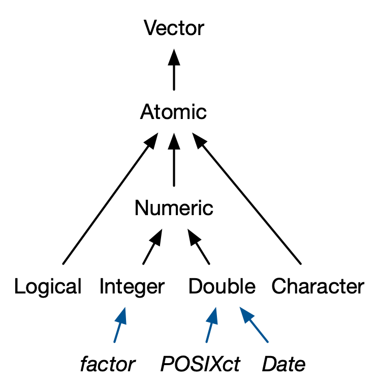
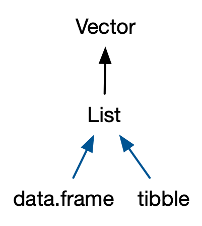

## Reminders

- If you haven't yet -- turn in the last set of exercises!
- Check the Slack workspace for any updates

## Review of names and values

- Careful about defining names and values
- Object size
- Using certain data structures over others

## Garbage collection

- `gc()`

```{r, echo=TRUE}
gc()
```

- Runs automatically whenever R needs more memory to create a new object
- OS reclaims memory from R when needed

## Tibbles vs. data frames

```{r, echo=TRUE}
library(tidyverse)
library(lobstr)
obj_size(as_tibble(iris)) - obj_size(iris)

obj_size(attr(iris, "class"))
obj_size(attr(as_tibble(iris), "class"))
```

## Tibbles vs. data frames

```{r, echo=TRUE}
dim(iris)

iris_long <- iris |>
  pivot_longer(-Species, names_to = "type", values_to = "measurement")

dim(iris_long)

obj_size(iris_long) / obj_size(iris)
```

## Final thoughts on exercises

- Longer does not guarantee improved efficiency 
- Tibbles vs. data frames: more to come
- Garbage collection can be random

## Activity: Vectors

With a few classmates around you, play around with vectors in R. Using PollEV, describe what you did or something about vectors in R.

- [PollEv.com/jericholawson192](PollEv.com/jericholawson192)

## Introduction

- Two categories: atomic vectors and lists
  - `NULL` closely related
- Attributes
  - dimension, class

```{r, echo=TRUE}
list(1, 2, 3, 4)
c(1, 2, 3, 4)
```

## Atomic vectors

- What we think of when we see a "vector"
- `c()` for concatenation

```{r, echo=TRUE}
c("a", "b", "c", "d") # character
c(1, 2, 3, 4) # double
c(1L, 2L, 3L, 4L) # integer
c(T, F, T, F) # logical
```


## Testing and coercion

- Testing: use `is.__()`
- Coercion: use `as.__()`

```{r, echo=TRUE}
a <- c(1, 2, 3)
is.double(a)
as.character(a)
```

- **Question:** Which atomic vector types take more precedent than the others?


## Attributes

- name-value pairs that attach metadata to an object
- `attr()` to add attributes
- `attributes()` to see attributes

```{r, echo=TRUE}
x <- rep(1, 5)
attr(x, "des") <- "repeats of 1"
attributes(x)
```

## Attributes (cont.)

```{r, echo=TRUE}
names(x) <- rep("name", 5)
attributes(x)
```

## S3 atomic vectors

::: columns
::: {.column width="60%"}
- object with class attribute
  - e.g. factors, Dates, POSIXcts

::: 
::: {.column width="40%"}

{fig-align="center"}

::: 
::: 

## S3 atomic vectors (cont.)

```{r, echo=TRUE}
groups <- factor(c("w", "t", "w", "l"))
class(groups)
attributes(groups)
```
- **On your own:** Create date and POSIX.ct objects using examples from the textbook.

## Lists

- Recursive factors
- use `list()` to build list

```{r, echo=TRUE}
myList <- list(4, "apple", c(T, F))
myList
```

## Data frames and tibbles

::: columns
::: {.column width="40%"}

{fig-align="center"}

::: 
::: {.column width="60%"}

- Data frames: named list of vectors with attributes for `names` and `row.names`
  - Has `data.frame` class
- Tibbles: replacements for data frames
  - Do less, complain more

::: 
::: 

## Data frames and tibbles (cont.)

- `tibble()` never coerces an input
- `tibble()` won’t transform non-syntactic names
- `tibble()` only recycles vectors of length 1
- `tibble()` allows references to created variables
- `[` always returns a tibble
- `$` doesn’t do partial matching

## `nest()` and `unnest()`

```{r, echo=TRUE}
library(tidyr)
nrow(starwars)

starwars_person_film <- starwars |>
  unnest(films)

nrow(starwars_person_film)

starwars_person_film |>
  nest(films) |>
  nrow()
```


## For now and Thursday: 

- Work on exercises: Vectors

